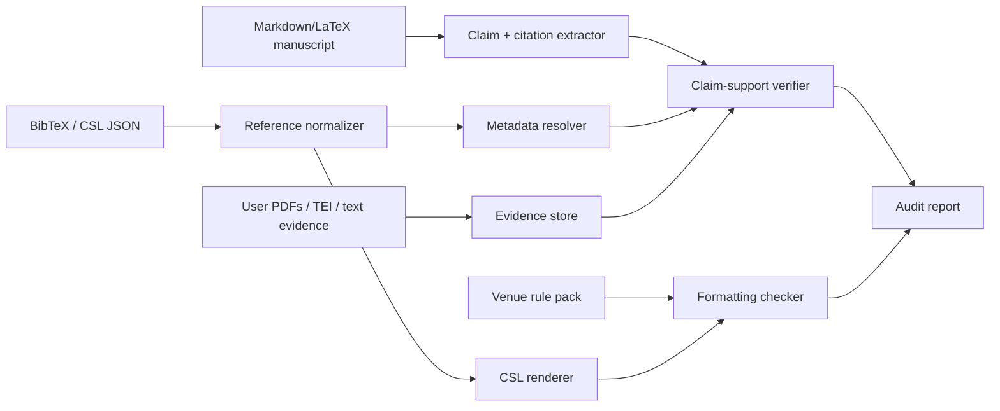

# CiteKit

CiteKit is a verifiable citation audit engine for research writing. It checks three
different things separately:

1. Whether each reference is real and its metadata matches resolver data.
2. Whether a cited source actually supports the claim that cites it.
3. Whether the bibliography follows a target venue's formatting rules.

That separation is the point. Formatting should never mutate truth, and claim
verification should never be hidden inside citation rendering.

## Install

```bash
pnpm install
pnpm build
```

During development, run commands through `tsx`:

```bash
pnpm dev -- check tests/fixtures/paper.md \
  --bib tests/fixtures/refs.bib \
  --style ieee \
  --venue ieee \
  --evidence tests/fixtures/evidence \
  --metadata-fixture tests/fixtures/metadata.json
```

After building, use the compiled CLI:

```bash
node dist/cli/index.js check paper.tex \
  --bib refs.bib \
  --style ieee \
  --venue acm-sigconf \
  --evidence ./pdfs \
  --report html \
  --out citekit-report.html
```

## CLI

### `citekit check`

Runs the full audit.

```bash
citekit check paper.tex \
  --bib refs.bib \
  --style ieee \
  --venue acm-sigconf \
  --evidence ./evidence \
  --report json \
  --out report.json
```

Useful options:

- `--bib <path>`: required. Supports BibTeX (`.bib`) and CSL JSON (`.json`).
- `--style <style>`: CSL template name. Defaults to `ieee`.
- `--venue <venue>`: venue rule pack id from `venues/*.yaml`.
- `--evidence <paths...>`: files or directories containing `.txt`, `.md`, `.tex`,
  `.xml`, `.tei`, or `.pdf` evidence.
- `--metadata-fixture <path>`: deterministic resolver fixture for tests and offline CI.
- `--offline`: disables live metadata providers.
- `--report json|html`: output format.
- `--out <path>`: writes the report to a file.

The command exits with code `1` when it finds reference errors, contradicted or
unverifiable claims, or formatting failures.

### `citekit format`

Renders a bibliography and applies venue rule checks.

```bash
citekit format refs.bib --style nature --venue nature --out references.md
```

### `citekit explain`

Explains one claim from a JSON report.

```bash
citekit explain report.json --claim C12
```

## Library API

```ts
import {
  FixtureMetadataProvider,
  runCitationAudit
} from 'citekit';

const provider = await FixtureMetadataProvider.fromFile('metadata.json');

const report = await runCitationAudit({
  manuscriptPath: 'paper.md',
  bibliographyPath: 'refs.bib',
  style: 'ieee',
  venue: 'ieee',
  evidencePaths: ['./evidence'],
  metadataProviders: [provider]
});
```

Public types include:

- `CitationAuditInput`
- `ReferenceRecord`
- `ClaimCitationLink`
- `EvidenceSpan`
- `VerificationVerdict`
- `VenueRulePack`
- `AuditFinding`

## Trust Model

CiteKit is strict by default.

- A real paper with wrong title, authors, DOI, or year becomes `metadata_mismatch`.
- A missing paper becomes `not_found`.
- A claim with no available source text becomes `unverifiable`.
- A claim only becomes `supported` when retrieved source text directly supports it.
- Optional AI classifiers can only classify retrieved evidence spans. If a classifier
  returns a span id that was not retrieved, CiteKit downgrades the claim to
  `unverifiable`.

No source text means no support verdict. That is intentional.

## Architecture



## Venue Rule Packs

Rule packs live in `venues/*.yaml`. They intentionally cover checks that CSL alone
does not express cleanly:

```yaml
id: ieee
label: IEEE
cslStyle: ieee
rules:
  requireDoi: true
  requireUrlWhenNoDoi: true
  disallowUrlWhenDoiPresent: true
  requireYear: true
  referenceOrder: citation_order
  maxAuthorsBeforeEtAl: 6
```

CSL handles rendering. Rule packs handle venue policy.

## Metadata Providers

CiteKit includes provider adapters for:

- Crossref
- OpenAlex
- Semantic Scholar
- Local JSON fixtures for tests and offline CI

Live provider errors do not crash the audit. They produce no candidates, allowing
other providers to resolve the reference.

## Tests

```bash
pnpm typecheck
pnpm test
pnpm build
```

The test suite covers:

- BibTeX normalization
- Markdown and LaTeX claim extraction
- fake DOI detection
- metadata mismatch detection
- supported, contradicted, and unverifiable claims
- venue rule failures
- offline CLI end-to-end reporting
