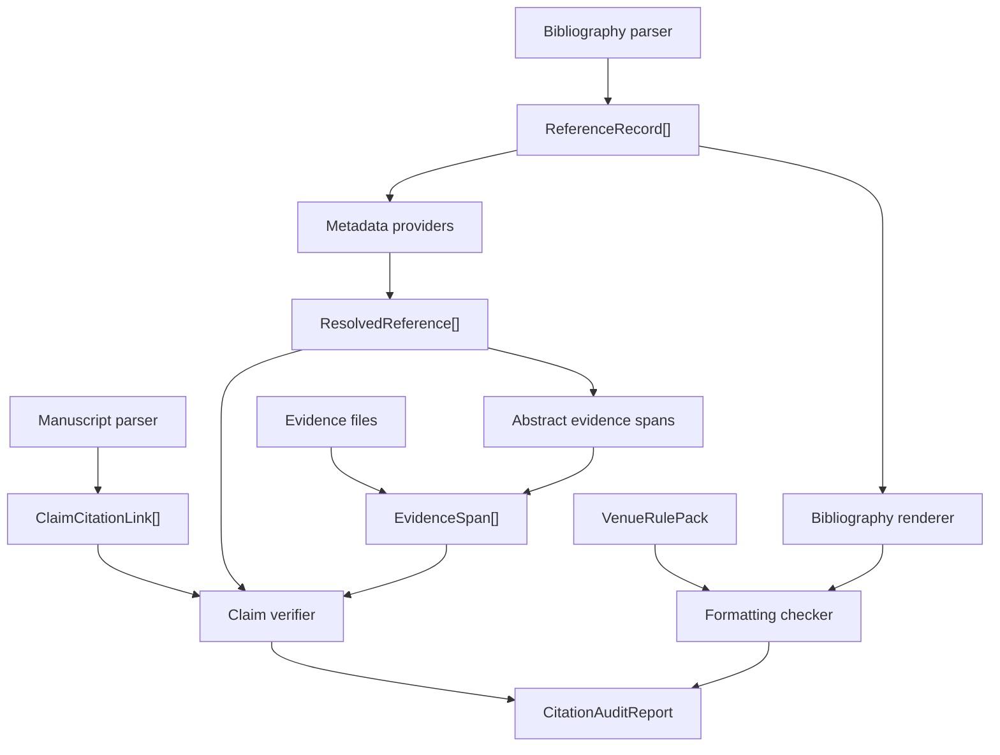

# CiteKit Architecture

CiteKit treats citation verification as a pipeline with explicit proof objects.

## Data Flow

## Components

- Claim extraction reads Markdown and LaTeX citation syntax and emits cited claim
  objects with source line numbers.
- Reference normalization reads BibTeX or CSL JSON and produces stable
  `ReferenceRecord` objects.
- Metadata resolution queries configured providers and compares DOI, title, year,
  and authors against the input reference.
- Evidence loading reads local evidence files, including PDFs through `pdf-parse`,
  and binds spans to bibliography ids.
- Claim verification only judges retrieved spans. It does not search the web during
  claim classification.
- Formatting renders the bibliography and applies venue policy checks from YAML rule
  packs.
- Style resolution first tries Citation.js built-ins, then packaged CSL files in
  `styles/*.csl`, then local project styles. Venue packs can provide the default
  `cslStyle`, so users can run `--venue nature` without also remembering the style id.

## Failure Behavior

The audit exits non-zero for:

- `not_found`
- `metadata_mismatch`
- `contradicted`
- `unverifiable`
- formatting `fail`

Warnings do not fail the command. Examples: ambiguous metadata, weak claim support,
or style preferences such as removing URLs when a DOI exists.
