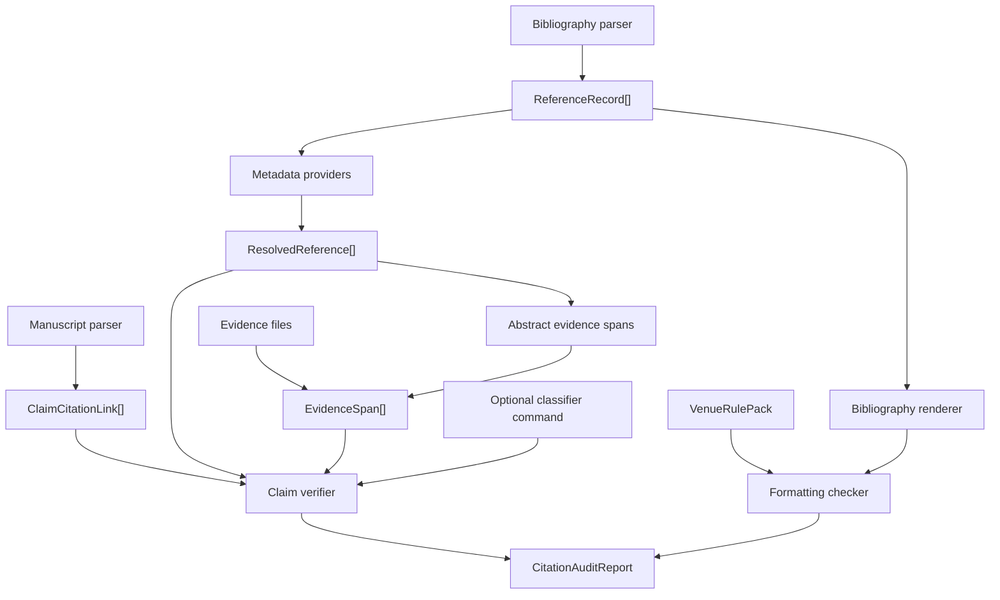
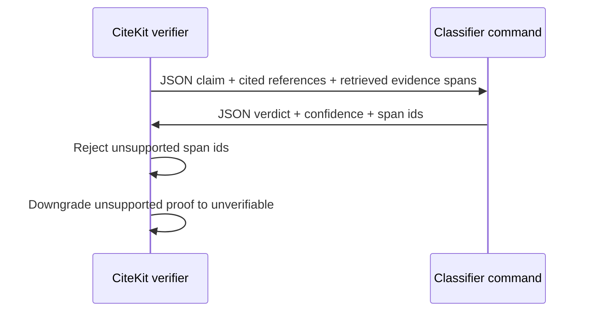

# CiteKit Architecture

CiteKit treats citation verification as a pipeline with explicit proof objects.

## Data Flow

## Components

- Claim extraction reads Markdown and LaTeX citation syntax and emits cited claim
  objects with source line numbers.
- Reference normalization reads BibTeX, RIS, or CSL JSON and produces stable
  `ReferenceRecord` objects.
- Metadata resolution queries configured providers and compares DOI, title, year,
  and authors against the input reference.
- Metadata cache wrapping can persist provider responses in JSON so repeated audits
  are deterministic and do not hit resolver APIs unnecessarily.
- Evidence loading reads local evidence files, including PDFs through `pdf-parse`,
  and binds spans to bibliography ids.
- Remote evidence loading is opt-in. When enabled, CiteKit fetches text/XML/HTML/PDF
  content URLs exposed by resolved metadata, converts them into evidence spans, and
  keeps URL locators in the proof object.
- Claim verification only judges retrieved spans. It does not search the web during
  claim classification.
- Optional classifier commands receive only the claim, cited references, and retrieved
  spans for that claim. They must return span ids from the request before CiteKit will
  accept a `supported`, `weak_support`, or `contradicted` verdict.
- Formatting renders the bibliography and applies venue policy checks from YAML rule
  packs.
- Bibliography formatting can reorder references for the target venue. Citation-order
  venues use extracted manuscript claims when a manuscript is supplied to
  `citekit format --manuscript`.
- Style resolution first tries Citation.js built-ins, then packaged CSL files in
  `styles/*.csl`, then local project styles. Venue packs can provide the default
  `cslStyle`, so users can run `--venue nature` without also remembering the style id.

## Failure Behavior

The audit exits non-zero for:

- `not_found`
- `metadata_mismatch`
- `contradicted`
- `unverifiable`
- formatting `fail`

Warnings do not fail the command. Examples: ambiguous metadata, weak claim support,
or style preferences such as removing URLs when a DOI exists.

## Proof Objects

Every non-passing finding carries enough context to inspect the result without
trusting the verifier blindly:

- Reference findings include resolver source, mismatch field, expected value, and
  actual value.
- Claim findings include evidence span ids plus quoted evidence text, source type,
  path, and locator when available.
- Formatting findings include the rule that failed and the suggested fix.

## External Classifier Boundary

The command adapter uses `spawn` without a shell. Shell syntax such as pipes,
redirection, and environment expansion is not interpreted by CiteKit. Users who need
that behavior can wrap it in a script and pass the script as the classifier command.
